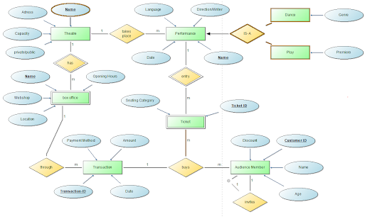
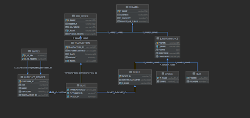

# DB-Project
 First SQL Project with
 
 HTML, Bootstrap, PHP enabling CRUD from web
 
 Java for mocking data, enabling .csv input 

## Idea
This model corresponds to the idea of theatres as we know them in Vienna. 

A theatre has a name, which is enough to be an unique identifier, since there is a very limited number of
them. Furthermore, it has an adress, a seating capacity and is either privately or
state-funded. A theatre has one or more box offices, which have defined opening hours, a
name, a location within the theatre and a webshop for purchasing tickets online.

Performances take place in a theatre, with language, directors a date and name as
attributes. There are specific performances, a dance-performance, with a genre, and a
classic play, which can premiere. Audience members can experience these performances by
buying tickets, with a seating category and an ID, either through the webshop, or physically
at the box office.

An audience member can buy multiple tickets, for oneself, or invite along others. Even if
he/she buys multiple tickets, if they are bought at the same time, they are part of one
transaction. The transaction is defined by an ID, has a date, an amount and a payment
method. Audience members can be identified by their automatically assignend customer ID
and have a name and an age, aswell as a discount, which can apply if they have a
Membership, or are a student or pensioneer.

## Modelling

Initial Diagram

Final Diagram rendered by DataGrip based upon actual tables and relations
## Implementation

I initially thought about hard coding values for my relations, or generating them from within
the java application, but quickly realized that using file imports was a more modular
approach. I (hope) the initial workload of configuring the inputs paid off in debugging and
changing off table columns.
While I handpicked some of the data, to make sense in this context, I let other entries be
generated by https://mockaroo.com/.
Testing of php was done via a docker-hosted instance. I chose bootstrap for the simplicity
and a way more elegant appearance than bare html.

## Deployment

To configure the input of data from .csv(s) via the java application, the files path has to be corrected
to the current dir, the csv(s) are contained in the java src dir

Simple Interface for reading and truncating table data is served via the Java main,
best suited for large amounts of data, that can easily be configured by changing the .csv(s)

php(s) should run by its own, but certain IDEs might want to cache the bootstrap imports.
Idea: enables more specific interaction with data
